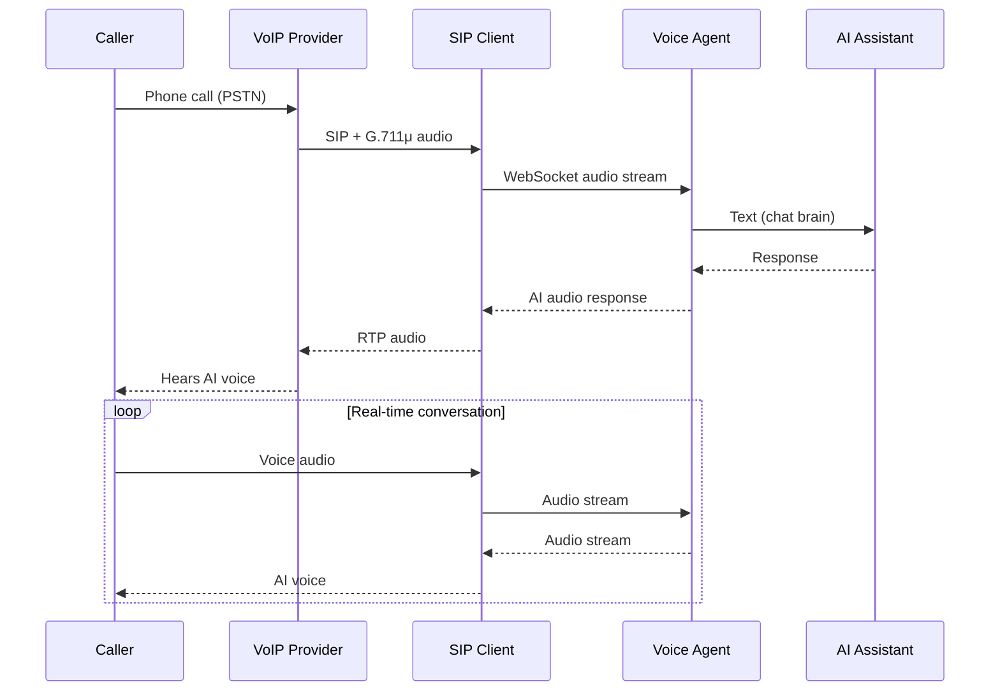

# Voice Agent

AI voice agent that answers phone calls. Four pluggable pillars — swap any piece.

Read more: [Voice Agent: Norm Macdonald on the Phone](https://wemble.com/2026/02/16/voice-agent.html)  
Watch demo: [YouTube](https://www.youtube.com/watch?v=ZNgLWurtx-Y)

## Architecture



### The Four Pillars

| Pillar | Role | Current | Alternatives |
|--------|------|---------|-------------|
| **[VoIP Provider](docs/voip_provider.md)** | Phone network (PSTN) — phone numbers, SIP accounts, call routing | voip.ms | Twilio, Vonage, Telnyx |
| **[SIP Client](docs/sip_client.md)** | Call signaling and audio transport (G.711μ) | baresip | pjsua, opal |
| **[Voice Agent](docs/voice_agent.md)** | Realtime voice — listens, thinks, speaks | Grok (xAI) or [Local pipeline](docs/local-voice-pipeline.md) | OpenAI Realtime, Gemini |
| **[AI Assistant](docs/ai_assistant.md)** | Text chat brain — conversational intelligence via local gateway | OpenClaw | direct API calls |

Each pillar has a base class and a swappable implementation:

```
VoipProvider          → VoipProvider::Voipms
SipClient             → SipClient::Baresip
VoiceAgent            → VoiceAgent::Grok | VoiceAgent::Local
AiAssistant           → AiAssistant::OpenClaw
```

## Setup

See [docs/setup.md](docs/setup.md) for full installation and configuration.

```bash
brew install baresip               # SIP client
bundle install                     # Ruby deps
cp .env.local.example .env.local   # Fill in credentials
```

Review `config/default.yml` for provider selection, baresip options, and agent profiles.

Requires Ruby 4.0+ (`.ruby-version` included).

## Quick Start

```bash
bin/voip balance             # Check provider balance
bin/call status              # Check SIP registration
bin/call 5550100          # Call with default agent
bin/call 5550100 --agent jarvis  # Call as Jarvis
bin/call hangup              # Hang up
```

## Agent Profiles

Agent profiles in `config/default.yml` define the voice persona — name, voice, and personality. Select one at call time with `--agent`:

```bash
bin/call 5550100 --agent ara      # Cheeky and playful
bin/call 5550100 --agent jarvis   # Formal British butler
bin/call 5550100 --agent garbo    # Straightforward helper
```

See [docs/config.md](docs/config.md) for the full config reference and how to add custom agents.

## Local Voice Pipeline (Qwen3-TTS)

Run STT and TTS locally on Apple Silicon instead of using the Grok Realtime WebSocket API. Uses [mlx-whisper](https://github.com/ml-explore/mlx-examples/tree/main/whisper) for speech-to-text and [Qwen3-TTS](https://github.com/ml-explore/mlx-audio) for text-to-speech, with the Grok text API for the LLM layer.

Switch to the local pipeline in `config/default.yml`:

```yaml
voice_agent:
  provider: local   # instead of "grok"
```

### Voice Cloning

Clone any voice from a 5-15 second reference audio clip. Drop a clean WAV in `tts/ref_audio/` and point an agent profile at it:

```yaml
agents:
  norm:
    name: Norm
    ref_audio: tts/ref_audio/norm_macdonald_moth.wav
    ref_text: >
      A moth goes into a podiatrist's office and the podiatrist says,
      what's the problem? And the moth says, what's the problem? Where
      do I begin, man? I go to work for Gregory Oleniewicz...
    personality: >
      You are Norm Macdonald. Dry, deadpan delivery. You love long,
      meandering stories that seem to go nowhere before landing an
      absurd punchline.
```

```bash
bin/call 5550100 --agent norm    # Listen to Norm drone on and never get to the point
bin/call 5550100 --agent trump   # The best calls. Tremendous. Everyone says so.
```

Built-in speakers (no reference audio needed): serena, vivian, uncle_fu, ryan, aiden, ono_anna, sohee, eric, dylan

### Setup

```bash
/opt/homebrew/bin/python3.12 -m venv tts/.venv
tts/.venv/bin/pip install mlx-audio mlx-whisper numpy scipy soxr
```

Runs on any Apple Silicon Mac. The 4-bit quantized model fits in 8GB RAM (tightly). See [docs/local-voice-pipeline.md](docs/local-voice-pipeline.md) for performance numbers, architecture details, and known issues.

## CLI

| Command | Description |
|---------|-------------|
| `bin/call <number>` | Call a phone number (uses default agent) |
| `bin/call <number> --agent <name>` | Call with a specific agent profile |
| `bin/call <number> --instructions "..."` | Override personality (keeps voice/name from agent) |
| `bin/call <number> --verbose` | Call with debug logging |
| `bin/call status` | Check SIP registration |
| `bin/call hangup` | Hang up active call |
| `bin/call calls` | List active calls |
| `bin/voip balance` | Provider account balance |
| `bin/voip dids` | List phone numbers |
| `bin/voip subaccounts` | SIP sub-accounts |
| `bin/voip servers` | Available SIP servers |

## Tests

```bash
rake test
```

## Monitoring

The `monitors/` folder contains a shell-based monitoring script for production use. It checks:

- **SMS messages** - voip.ms API for new messages (every 5 min)
- **Missed calls** - voip.ms call logs (every 10 min)
- **Zombie processes** - defunct/orphaned bin/call, baresip, Ghostty

**Zero-token monitoring:** Runs checks directly in shell, only spawns OpenClaw sessions when alerts are needed.

```bash
# Install to system crontab
crontab -e

# Add this line
*/5 * * * * ~/Projects/voice-agent/monitors/monitor >> ~/clawd/logs/monitor-voice.log 2>&1

# Test manually
~/Projects/voice-agent/monitors/monitor
```

See [monitors/README.md](monitors/README.md) for full details.
