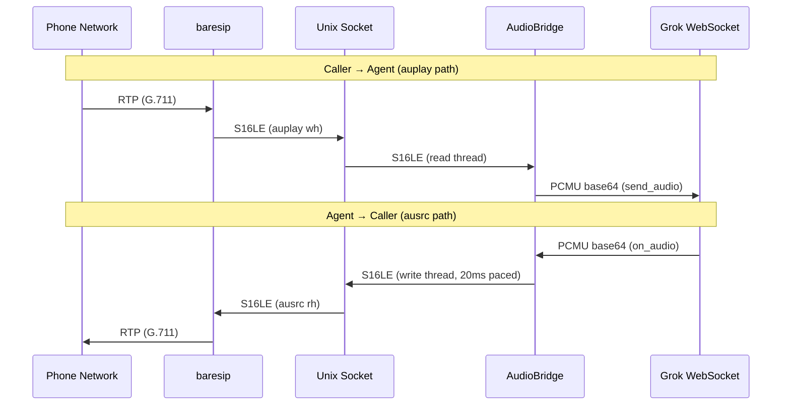

# Audio Bridge

The audio bridge connects baresip's audio pipeline to the voice agent. It has two parts: a C module (`ausock`) that plugs into baresip, and a Ruby class (`AudioBridge`) that converts and shuttles audio between the Unix socket and the voice agent's WebSocket.

## Architecture



## ausock — baresip C module

`ext/ausock/ausock.c` registers both `ausrc` (audio source) and `auplay` (audio player) with baresip:

- **auplay** (caller → agent): A thread pulls decoded S16LE frames from baresip and writes them to the socket.
- **ausrc** (agent → caller): A thread reads S16LE frames from the socket and pushes them into baresip's encode pipeline.

Both threads use monotonic clock pacing (`CLOCK_MONOTONIC`) to deliver frames at exact 20 ms intervals without drift.

### Socket protocol

A single full-duplex Unix stream socket at `/tmp/ausock.sock`. No framing — raw S16LE bytes flow in both directions simultaneously. Frame size is 320 bytes (160 samples at 8 kHz, 16-bit, mono = 20 ms).

The socket path defaults to `/tmp/ausock.sock` and can be overridden with the `AUSOCK_PATH` environment variable.

### Build and install

```sh
make -C ext/ausock
make -C ext/ausock install
```

Override the module directory if needed:

```sh
make -C ext/ausock install MODULE_DIR=/path/to/baresip/modules
```

### Dependencies

- libre (pkg-config: `libre`)
- baresip headers (pkg-config: `libbaresip`)
- C compiler with C99 support

### baresip config

When `voice_socket` is passed to `SipClient::Baresip.new`, the config automatically includes:

```
module          ausock.so
audio_source    ausock,/tmp/ausock.sock
audio_player    ausock,/tmp/ausock.sock
```

## AudioBridge — Ruby class

`lib/audio_bridge.rb` connects to the ausock Unix socket and runs two threads:

- **Read thread**: reads S16LE from socket → converts to PCMU → calls `voice_agent.send_audio`
- **Write thread**: dequeues PCMU from voice agent → converts to S16LE → writes to socket at 20 ms intervals

### Interface

```ruby
bridge = AudioBridge.new(voice_agent, socket_path: '/tmp/ausock.sock')
bridge.start          # connect socket, start threads
bridge.enqueue(pcmu)  # called from voice agent's on_audio callback
bridge.stop           # close socket, join threads
bridge.bytes_in       # PCMU bytes sent to agent (caller → Grok)
bridge.bytes_out      # PCMU bytes sent to caller (Grok → caller)
```

### G.711 u-law codec

The bridge includes a pure-Ruby G.711 u-law (PCMU) codec:

```ruby
AudioBridge.linear_to_ulaw(sample)   # S16 → u-law byte
AudioBridge.ulaw_to_linear(byte)     # u-law byte → S16
AudioBridge.s16le_to_pcmu(data)      # batch encode
AudioBridge.pcmu_to_s16le(data)      # batch decode
```

Decoding uses a 256-entry lookup table. Encoding uses the standard segment compression table.

## Usage

```sh
bin/call 5550100                    # call with default agent
bin/call 5550100 --agent jarvis     # call as Jarvis
bin/call 5550100 --verbose          # call with debug logging
```

The `--verbose` flag logs timestamped events to stderr: WebSocket lifecycle, VAD events, audio byte counts, periodic stats, and a final summary on hangup.

## Audio timing — lessons learned

Getting clean audio through the bridge required careful timing at every stage. Two problems showed up in live calls:

### Problem 1: Stuttery, pulsating speech (silence every other frame)

Grok sends audio in large bursts (4-16 KB every ~200 ms) rather than steady 20 ms frames. The Ruby write thread needs to chop these bursts into 160-byte PCMU frames and pace them at 20 ms intervals. The original pacing code had a bug:

```ruby
# BUG: advances by 2x frame_duration (40 ms instead of 20 ms)
next_frame_at = [next_frame_at + frame_duration, now].max + frame_duration
```

This wrote one frame every 40 ms. Since the C src_thread reads every 20 ms, every other read found an empty socket and pushed silence — producing the characteristic "good speech with silent gaps" pattern.

**Fix:** Advance by exactly one frame duration after each write:

```ruby
next_frame_at += frame_duration
next_frame_at = now + frame_duration if next_frame_at < now  # reset if behind
```

### Problem 2: Cumulative timing drift (jitter over long calls)

Both C threads originally used `usleep(ptime * 1000)` for pacing. This sleeps for 20 ms *after* the work (read/write/callback), so the actual period is 20 ms + work time. Over a 30+ second call, the drift compounds and frames arrive at irregular intervals.

The src_thread had a related issue: `poll(fd, POLLIN, ptime)` uses ptime as the timeout, but when data arrives early, poll returns immediately, and the thread loops back with another 20 ms poll — drifting away from the original cadence.

**Fix:** Both threads now use a monotonic clock (`CLOCK_MONOTONIC` / `Process::CLOCK_MONOTONIC`) to schedule frames on absolute 20 ms boundaries:

```c
next_frame += ptime_us;
now = clock_us();
if (next_frame > now)
    usleep((unsigned)(next_frame - now));
else
    next_frame = now;  /* fell behind, reset */
```

This keeps rh()/wh() calls locked to a steady cadence regardless of how long each iteration takes.

### Remaining optimization opportunities

- **C-side resampling:** If Grok moves to 16/24 kHz, resample in the C module rather than Ruby.
- **Jitter buffer:** A small (2-3 frame) jitter buffer in the src_thread could absorb timing variance from Ruby's write pacing. Currently the src_thread reads whatever is available or pushes silence — a buffer would smooth the boundary.
- **Socket buffer tuning:** `SO_SNDBUF`/`SO_RCVBUF` on the Unix socket could be tuned to hold exactly N frames, preventing large bursts from backing up.
